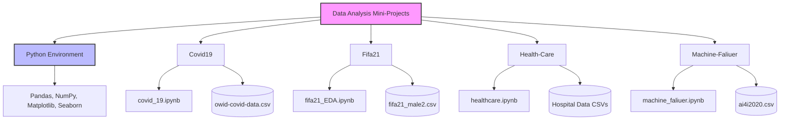

# Data Analysis Mini-Projects

## 1. Project Overview

This repository contains a collection of data analysis mini-projects implemented in Python using Jupyter Notebooks. Each project focuses on a specific dataset and domain, demonstrating various techniques in Data Cleaning, Exploratory Data Analysis (EDA), and Visualization.

The projects cover diverse topics:
*   **Covid-19 Analysis:** Tracking global pandemic trends.
*   **FIFA 21 EDA:** Analyzing football player stats and demographics.
*   **Healthcare Analytics:** Investigating hospital operations and patient data.
*   **Machine Failure Prediction:** Analyzing sensor data to understand machine reliability.

## 2. Project Structure

The project is structured as a collection of independent modules, each containing its own dataset and analysis notebook.



## 3. Directory Structure

```text
/home/abdo/Code/Python/ASDC-Tasks/Data-Analysis-Mini-Projects/
├── Covid19/
│   └── covid_19.ipynb          # Analysis of Covid-19 cases and deaths
├── Fifa21/
│   ├── fifa21_EDA.ipynb        # EDA on FIFA 21 player data
│   └── fifa21_male2.csv        # Dataset
├── Health-Care/
│   ├── healthcare.ipynb        # Healthcare data analysis
│   ├── sample_sub.csv          # Sample submission file
│   ├── test_data.csv           # Test dataset
│   ├── train_data.csv          # Training dataset
│   └── train_data_dictionary.csv # Data dictionary
├── Machine-Faliuer/
│   ├── ai4i2020.csv            # Machine sensor data
│   └── machine_faliuer.ipynb   # Failure prediction analysis
├── requirements.txt            # Python dependencies
└── README.md                   # Project documentation
```

## 4. Technologies & Tools

The projects utilize the standard Python Data Science stack:

*   **Language:** Python 3.x
*   **Environment:** Jupyter Notebook / IPython
*   **Libraries:**
    *   **Pandas:** For data manipulation and analysis (DataFrames).
    *   **NumPy:** For numerical operations.
    *   **Matplotlib:** For static plotting and visualizations.
    *   **Seaborn:** For statistical data visualization.

## 5. Installation & Usage Instructions

Follow these steps to set up and run the projects on your local machine.

### Prerequisites
*   Git
*   Python 3 installed
*   pip (Python package manager)

### Step-by-Step Setup

1.  **Clone the Repository**
    ```bash
    git clone <repository_url>
    cd Data-Analysis-Mini-Projects
    ```

2.  **Create a Virtual Environment (Optional but Recommended)**
    ```bash
    # For Linux/macOS
    python3 -m venv venv
    source venv/bin/activate
    
    # For Windows
    python -m venv venv
    .\venv\Scripts\activate
    ```

3.  **Install Dependencies**
    Install the required libraries using the provided `requirements.txt` file.
    ```bash
    pip install -r requirements.txt
    ```
    *Note: You may also need to install `notebook` or `jupyterlab` if you haven't already:*
    ```bash
    pip install notebook
    ```

4.  **Run the Projects**
    Launch the Jupyter Notebook interface:
    ```bash
    jupyter notebook
    ```
    This will open your web browser. Navigate to the specific directory of the project you want to explore (e.g., `Covid19/`) and open the `.ipynb` file (e.g., `covid_19.ipynb`).

5.  **Explore the Notebooks**
    *   **Covid19:** Run cells to visualize infection and mortality trends.
    *   **Fifa21:** Explore player stats, age distribution, and club ratings.
    *   **Health-Care:** Analyze hospital efficiency and patient demographics.
    *   **Machine-Faliuer:** Visualize sensor readings and correlation with machine failures.
